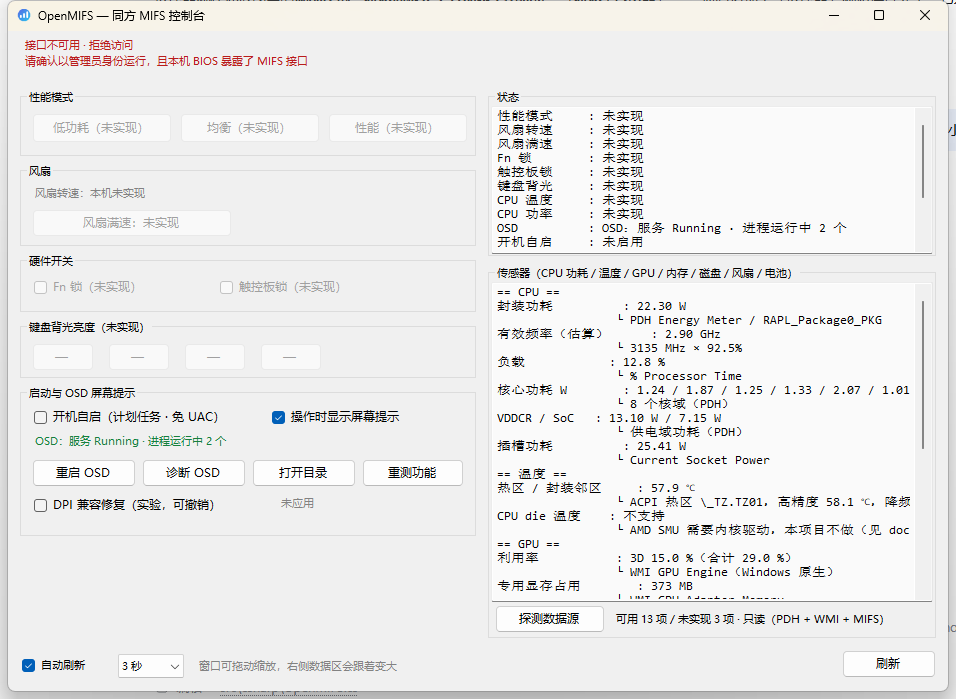
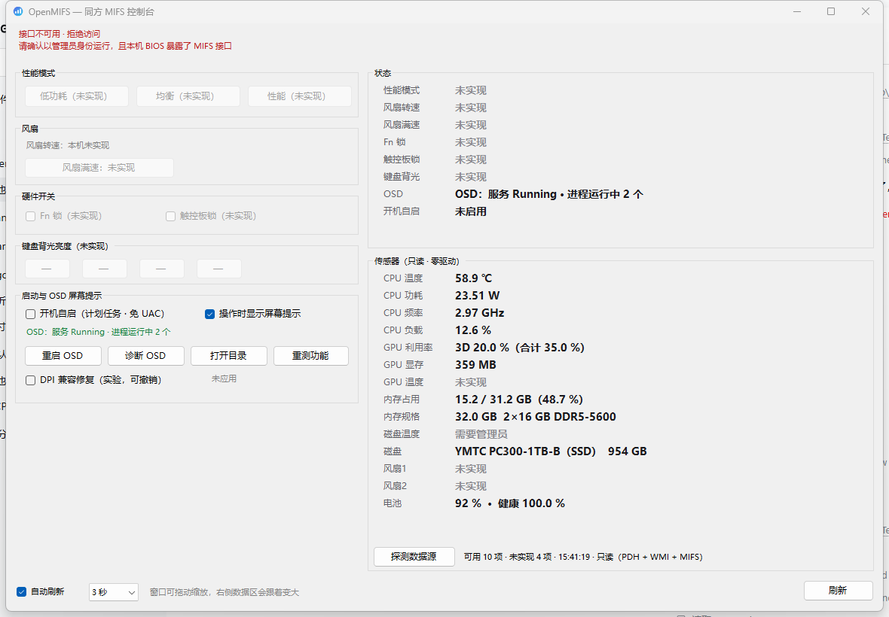

# OpenMIFS

**不装官方控制中心的同方 MIFS 控制台 —— 单文件 exe，零依赖。**

机械革命（MECHREVO / 同方 TongFang）有一部分机型的 BIOS 暴露了 **MIFS（MiInterface）** ACPI WMI 接口，
官方控制中心正是通过它来控制性能模式、风扇、键盘背光等硬件。

问题是：**很多机型官方压根没出过控制中心**（例如无界 14 Pro 2023），
于是这些接口就一直闲置，用户什么也调不了。

OpenMIFS 直接调用这个接口 —— 不安装任何官方组件、不加载任何驱动、不需要第三方运行库。

```
OpenMIFS.exe        ← 下载即用，单文件 109 KB，常驻任务栏通知区域
OpenMIFS.exe --diagnose   ← 无界面采集 OSD 诊断证据（排障用）
OpenMIFS.exe --sensors    ← 无界面传感器探测，逐项报告本机可用通道
mifs-gui.cmd        ← 从源码直接跑图形界面
mifs.cmd status     ← 从源码跑命令行版
```

---

## 三种形态

| 形态 | 文件 | 适合谁 |
| :--- | :--- | :--- |
| **托盘 exe** ⭐ | `OpenMIFS.exe` | 日常使用。单文件、免安装、常驻托盘，托盘菜单直接切模式 |
| 图形脚本 | `mifs-gui.cmd` | 不想跑 exe，或想改界面 |
| 命令行 | `mifs.cmd` | 脚本化、排查问题、提交机型数据 |

三种形态调用同一套接口，功能完全一致。



> 左列是硬件控制，右列是状态与传感器；**窗口可拖动缩放，数据区跟着变大**。
> 上面的截图是**非管理员**下运行的（左侧 MIFS 控件会置灰，右侧传感器不需要管理员照常工作）。


---

## 功能

### 托盘 exe / 图形界面

| 区域 | 说明 |
| :--- | :--- |
| 性能模式 | 低功耗 / 均衡 / 性能 一键切换，当前档位用 `●` 标记（本机实测：**均衡档性能与性能档相同、风扇低约 800 RPM**，日常推荐） |
| 风扇 | 各风扇实时转速（RPM） |
| 硬件开关 | Fn 锁、触控板锁定 |
| 键盘背光 | 亮度 0~3 档 |
| 风扇满速 | 一键强冷（机型支持时） |
| 启动与 OSD | 开机自启开关、OSD 状态、重启 OSD、诊断 OSD、重测功能 |
| 托盘提示 | 悬停显示的项目可选（白名单 + 最坏宽度预算，放不下的不允许勾），实时预览 |
| 状态面板 | 性能模式、Fn 锁、触控板锁、背光、供电、OSD、开机自启（键值行） |
| **传感器** | CPU 温度 / 功耗 / 频率 / 负载、GPU 利用率/显存/温度、内存、磁盘、风扇、电池 |
| 窗口 | **可拖动缩放**（默认 940×740，最小 700×560）：左列控制固定，右侧数据区跟着变大 |
| 自动刷新 | 可调 2 / 3 / 5 / 10 秒 |

**数据都是键值行显示，不是文本框**：灰色小标签 + 加粗数值，一行一个指标；
读不到的显示灰色「未实现」；数据源、估算公式、计数器名等细节放在鼠标悬停提示里。

exe 版本额外具备：

- **常驻托盘**：关闭窗口 = 最小化到通知区域，程序继续后台运行
- **托盘菜单**：右键托盘图标可直接切性能模式、开关风扇满速、开关开机自启、打开日志
- **托盘提示**：鼠标悬停显示当前模式与风扇转速
- **诊断日志**：每个动作写一行到 `%LOCALAPPDATA%\OpenMIFS\openmifs.log`
- **自带屏幕提示（替代官方 OSD）**：检测到 Fn 键改动了 EC 值，就在屏幕下方弹一条提示
- **传感器面板**：CPU 封装功耗（AMD RAPL）、热区温度、GPU 利用率、内存/磁盘/风扇/电池 ——
  **全部免驱动**，只读 Windows 自带的性能计数器与 WMI
- **开机自启**：注册计划任务（`/RL HIGHEST` + `--tray`），登录时静默以管理员身份启动，**不弹 UAC、也不弹主界面**（只驻留托盘）
- **能力探测**：写不进去的功能（例如本机的风扇满速）会被实测判定并**永久置灰**，不假装能用
- **单实例保护**：重复启动会提示，不会重复占用资源
- **自动提权**：清单里声明了 `requireAdministrator`，双击即弹 UAC，不用手动右键

未实现的功能会自动置灰并标注「未实现」，不会假装能用。

### 命令行

```powershell
.\src\mifs.ps1 status               # 显示状态（默认）
.\src\mifs.ps1 probe                # 诊断调用链（排错先跑这个）
.\src\mifs.ps1 test                 # 逐个探测驱动清单里的功能号
.\src\mifs.ps1 scan 63              # 扫描功能号 0..63，找出所有可用的
.\src\mifs.ps1 bench                # 实测各档功耗高低，校正模式映射（约 2 分钟）
.\src\mifs.ps1 mode low             # 切模式：low / balanced / performance
.\src\mifs.ps1 fanboost on          # 风扇满速开关
.\src\mifs.ps1 kbd 0                # 键盘背光 0~3
.\src\mifs.ps1 raw 19               # 对指定功能号发 GET，打印原始字节
.\src\mifs.ps1 osd status           # OSD（Fn 屏幕提示）服务与进程状态
.\src\mifs.ps1 osd restart          # 重启 OSD 服务与界面进程
.\src\mifs.ps1 osd diagnose         # OSD 诊断证据
.\src\mifs.ps1 startup on           # 开机自启：on / off / status
.\src\mifs.ps1 log                  # 打印日志路径 + 最后 20 行
.\src\mifs.ps1 sensors              # 传感器实时读数（只读）
.\src\mifs.ps1 sensors probe        # 探测本机有哪些传感器通道可用（只读）
```

`status` / `probe` / `test` / `scan` / `raw` / `osd status` / `osd diagnose` / `osd dpi` /
`startup status` / `log` / `sensors` 只发 GET 或只读计数器，不改任何状态。
`mode` / `fanboost` / `kbd` / `osd restart` / `startup on|off` 会写 EC 寄存器或改计划任务，都是可逆操作。

---

## 实测机型与能力矩阵

| 功能号 | 功能 | 无界 14 Pro 2023（R7-7840HS） |
| :---: | :--- | :---: |
| 8 | 性能模式 | ✅ |
| 10 | 键盘类型 | ✅ |
| 11 | Fn 锁 | ✅ |
| 12 | 触控板锁 | ✅ |
| 13 | 风扇转速 | ✅ 双风扇 |
| 18 | 键盘背光亮度 | ✅ |
| 19 | 供电状态 | ✅ |
| 20 / 21 | 风扇满速 | ⚠️ 接口响应但写入被忽略 |
| 9 | GPU 模式 | ❌ 无独显 |
| 16 / 17 | RGB 模式 / 颜色 | ❌ 白光键盘 |
| 22 / 23 | CPU 温度 / 功率 | ❌ |

详细实测记录见 [docs/TESTED-MODELS.md](docs/TESTED-MODELS.md)。

---

## 已知限制

1. **无法用软件限制充电到 80%。** MIFS 接口的功能号里没有电池充电阈值，
   本工具、官方控制中心、任何第三方工具在这类机型上都做不到。
   只能进 BIOS 找相关选项，或者手动拔插适配器。
2. **风扇调速：接口存在，但在本机不可用（已实测定论）。**
   上游 `tongfang-mifs-wmi` 文档写明 MIFS 的 `20` 号是**手动风扇控制开关**、`21` 号是 **PWM 占空比**，
   但同一份文档也写明：**满速/性能模式要求圆口 DC 供电**（电池与 Type-C 供电下驱动直接返回 `EOPNOTSUPP`）。
   本机 `fn=19` 恒为 `1`（Type-C）且**只有 USB-C 供电口**，门控无法满足；
   实测（`mifs.cmd fan test`，按**转速**判定而不是寄存器读回）：基线 3143 RPM → 开满速 8 秒后 3166 RPM，
   **+23 RPM 属于噪声，EC 未执行**。

   **替代方案（推荐且已验证）**：切「低功耗 / 均衡」模式降低功耗墙 → 发热减少 → EC 自己把风扇降下来。
   想要真正的曲线控制只能走 EC RAM（PawnIO 等第三方签名内核驱动），本项目不做。
   完整分析与实测数据见 [docs/FAN-CONTROL.md](docs/FAN-CONTROL.md)。
3. **不同机型的功能号含义可能不同。** 功能号来自 Linux 内核驱动
   `tongfang-mifs-wmi` 的逆向结果，厂商并未公开。如果发现对不上，
   用 `bench` 实测校正，并欢迎提 issue 反馈。
4. **性能模式的值编码可能因机型而异。** 上游驱动标注 `0=均衡 1=性能 2=低功耗`，
   但无界 14 Pro 2023 实测是 `0=性能 1=均衡 2=低功耗`。
   映射写在 `src/mifs.ps1`、`src/mifs-gui.ps1`、`src/csharp/OpenMIFS.cs` 顶部，可自行修改。

---

## 诊断日志

三种形态（exe / 图形脚本 / 命令行）**共用同一份日志**：

```
%LOCALAPPDATA%\OpenMIFS\openmifs.log        （超过 1 MB 自动轮转为 openmifs.log.1）
%LOCALAPPDATA%\OpenMIFS\capabilities.txt    （能力探测缓存，删掉即重新探测）
%LOCALAPPDATA%\OpenMIFS\osd-diagnose.txt    （OSD 诊断输出）
```

每个动作一行，带毫秒时间戳、进程号、线程号和来源标记：

```
2026-10-03 14:19:01.985 [INFO ] pid=4176 tid=1 | 首次刷新完成：接口可用=True 未实现=风扇满速、CPU 温度 OSD状态=OSD：服务 Running · 进程运行中 1 个
2026-10-03 14:22:10.412 [INFO ] pid=4176 tid=1 | 切换性能模式 → 均衡（写 fn=8 值=1）
2026-10-03 14:22:10.690 [INFO ] pid=4176 tid=1 | 性能模式读回 = 均衡
```

**所有写操作都会记录写后读回值** —— 这是判断「EC 到底有没有理会」的唯一依据。
出问题时把日志尾部贴进 issue，比截图有用得多。

日志只在动作、状态变化和异常时写，自动刷新不会刷屏。
不想要日志可以删掉这个目录，程序会在下次启动时重建。

---

## OSD 屏幕提示不显示怎么办

部分机型（例如无界 14 Pro 2023）装了官方 OSD（`C:\Program Files\OSD\`：
服务 `BLDHotKeyService` + 界面进程 `BLDFnHotkeyUtility.exe`），
但按键时屏幕提示不显示 —— 服务在跑、进程也在跑。

OpenMIFS 提供两条路：

### 1. 先试着修（可撤销，不改系统设置）

exe 主界面的「启动与 OSD」区域，或命令行：

```powershell
.\src\mifs.ps1 osd status      # 服务、界面进程、系统 DPI、DPI 兼容标记状态
.\src\mifs.ps1 osd dpi-on      # 写 DPI 兼容标记（~ HIGHDPIAWARE），主要嫌疑
.\src\mifs.ps1 osd restart     # 重启 服务 → 界面进程，让设置生效
.\src\mifs.ps1 osd diagnose    # 取证：OSDEvents / 心跳 / 显示环境 / DPI
.\src\mifs.ps1 osd dpi-off     # 撤销 DPI 标记（删掉注册表值，无残留）
```

`osd restart` 只做三件事：`sc stop/start BLDHotKeyService`、结束并重启 `BLDFnHotkeyUtility.exe`。
`osd dpi-on` 只写一条标准兼容性标记（`HKLM\...\AppCompatFlags\Layers`，
和「属性 → 兼容性 → 更改高 DPI 设置」写的是同一条），`osd dpi-off` 即删除。

**为什么先怀疑 DPI**：本机实测 —— 官方 OSD 的界面进程 `BLDFnHotkeyUtility.exe`
是 **DPI 不感知**的（清单只有 `asInvoker`），而系统缩放是 **125%**；
它的提示用 `UpdateLayeredWindow` 画分层窗口，在 DPI 不匹配时可能**静默失效**
（不报错、不崩溃、日志照写）。这也是它看起来"服务在跑、进程也在跑，就是没提示"的原因。

### 2. 直接用它自带的屏幕提示（不依赖官方 OSD）

「启动与 OSD → 屏幕提示」有三档，默认 **自动（不重复）**：

| 模式 | 行为 | 什么时候用 |
| :--- | :--- | :--- |
| **自动（默认）** | 官方 OSD 的提示窗**此刻可见**就让位，不重复显示 | 平时 |
| 总是显示 | 不管官方 OSD，总显示自带的 | 官方 OSD 又坏了 |
| 关闭 | 完全不显示自带提示 | 只用官方 OSD |

**自动模式怎么判断的**：按 Fn 后 OpenMIFS 会延迟 350 ms，再枚举顶层窗口，
找 `BLDFnHotkeyUtility.exe` 用来画提示的那个分层窗（标题 `FloatingNativeWindow`、`WS_VISIBLE`、尺寸合理）。
它正在画 → 跳过自带的；它没画 → 弹自带的。判定结果写在日志里：
`官方 OSD 正在显示，跳过自带提示：性能模式 · 均衡`。

> 为什么不用"服务/进程健在"当判据：这三种信号都正常时，官方 OSD 依然可能什么都不画
> （实测过：服务 Running、进程在跑、`OSDEvents` 照收 Fn 事件，屏幕就是空的）。
> 只有**窗口真的可见**才说明它画出来了。

自带提示会在屏幕下方弹一条半透明提示，1.6 秒后消失，内容取自 EC 读回的真实值
（性能模式 / Fn 锁 / 触控板锁 / 键盘背光 / 风扇满速）。

反过来这也很好用：按一下 Fn+切换模式，如果**官方 OSD 弹了、OpenMIFS 没弹**，
说明两者都在正常工作、没有重复；如果**只有 OpenMIFS 弹**，说明官方 OSD 的显示环节又坏了。

### 完整诊断证据

```powershell
OpenMIFS.exe --diagnose     # 无界面，写 %LOCALAPPDATA%\OpenMIFS\osd-diagnose.txt
```

包含：服务/进程状态与启动时间、安装目录清单、服务安装日志尾部、最近 30 天相关事件日志
（`BLDFnHotkeyUtility.exe is running...` 心跳会被折叠成一行并给出**时间范围**）、显示器数量与分辨率。

完整说明（组件构成、证据怎么读、三级修复步骤、不要做的事）见
[docs/OSD.md](docs/OSD.md)。

**取证要点**：`OSDEvents` 日志源有没有近期条目，决定了"Fn 事件有没有送到 OSD 进程"。
有 → 接收正常、坏在显示（DPI/分层窗口）；没有 → 事件链路本身有问题。
⚠️ 事件日志必须**按最新优先**读（`ReverseDirection`），否则海量心跳会吃光扫描额度，
得出"心跳早就停了"的错误结论 —— 这个坑我踩过，诊断器已修正。

---

## 开机自启

「启动与 OSD → 开机自启」勾上即启用。实现方式是**计划任务**（`OpenMIFS`，`/SC ONLOGON /RL HIGHEST`，命令行带 `--tray`），
不是注册表 `Run` 项 —— 因为 exe 声明了 `requireAdministrator`，用 `Run` 项的话**每次登录都会弹 UAC**，
而计划任务可以静默以最高权限启动。

```powershell
.\src\mifs.ps1 startup status   # 查询
.\src\mifs.ps1 startup on       # 启用（需要 dist\OpenMIFS.exe 存在）
.\src\mifs.ps1 startup off      # 关闭
schtasks /Query /TN OpenMIFS    # 也可以用系统命令查
```

关掉后不会残留任何东西（`schtasks /Delete /TN OpenMIFS /F`）。

---

## 传感器（硬件监控）

exe **首页右侧直接显示**（窗口可拖动缩放，数据区跟着变大），或 `.\src\mifs.ps1 sensors`。**全部免驱动**：


只读 Windows 自带的性能计数器（PDH）、WMI 与 MIFS，不加载任何第三方内核组件。

| 组件 | 指标 | 来源 |
| :--- | :--- | :--- |
| CPU | **封装功耗**（AMD RAPL）、每核功耗、SoC/VDDCR 域、插槽功耗 | PDH `\Energy Meter(*)\Power`（mW） |
| CPU | 有效频率（估算）、负载 | PDH `\Processor Information(_Total)` |
| 温度 | **CPU die 温度**、**核显温度**、SoC 温度、热区温度、降频原因 | **ADL2 PMLog（`atiadlxx.dll`，AMD 官方用户态通道 = Adrenalin 同源）** + PDH 热区 |
| GPU | 利用率（按引擎）、专用显存占用 | WMI `Win32_PerfFormattedData_GPUPerformanceCounters_*` |
| GPU | **功耗**、核显/显存频率 | ADL2 PMLog `ASIC_POWER` / `CLK_GFXCLK` / `CLK_MEMCLK` |
| 内存 | 容量 / 类型 / 速率 / 占用 | WMI `Win32_PhysicalMemory` + `Win32_OperatingSystem` |
| 存储 | 型号 / 介质 / 总线 / 健康 / **温度**（需管理员）/ 磨损 / 通电时长 | `MSFT_PhysicalDisk` + `MSFT_StorageReliabilityCounter` |
| 风扇 | 双风扇转速 | MIFS `fn=13` |
| 电池 | 电量 / 供电状态 / 健康度 | `Win32_Battery` + `root\wmi` 电池容量 |

本机（无界 14 Pro 2023）实测：空闲 CPU 封装功耗 10.8 W、8 线程满载 35.8 W，
热区温度 52.9 ℃ → 64.9 ℃ 随负载变化 —— 都是能标定的真值。
命令 `.\src\mifs.ps1 sensors probe` 会逐项告诉你这台机器哪些通道可用。

**CPU die 温度与核显温度都能读到** —— 走 AMD 显卡驱动自带的用户态 DLL `atiadlxx.dll`
（`ADL2_New_QueryPMLogData_Get`，也就是 Adrenalin「性能 → 指标」页的那套数据），
**不需要内核驱动、不需要管理员**。实测负载下 GPU 52→56 ℃、CPU 51→57 ℃ 同向变化。

**仍然读不到的**：主板 / VRM / 内存温度 —— 它们在 EC 与 SPD Hub 里，只有内核驱动能碰；
而能碰它们的方案（WinRing0 等）已被微软列入**易受攻击驱动黑名单**，与"不加载任何驱动"的定位冲突。

想要完整传感器（含 Tctl、主板、VRM），可以自己装并运行 LibreHardwareMonitor，
本工具**不打包、不加载**它的驱动。技术分析与实测依据见 [docs/SENSORS.md](docs/SENSORS.md)。

---

## 系统要求

| | 要求 |
| :--- | :--- |
| 系统 | Windows 10 1809+ / Windows 11 |
| 运行时 | 系统自带 **.NET Framework 4.8**（Win10 1809+ 与 Win11 均内置，无需安装） |
| 权限 | **管理员**（ACPI WMI 方法调用必需，exe 已自动提权） |
| 硬件 | 机型 BIOS 暴露了 MIFS 接口（用 `probe` 确认） |

编译 exe 不需要 .NET SDK、不需要 Visual Studio、不需要联网。

---

## 快速开始

### 方式一：直接下载 exe（推荐）

到 [Releases](https://github.com/aie1123/open-mifs/releases) 下载 `OpenMIFS.exe`，
双击运行，UAC 点「是」。程序会常驻任务栏通知区域。

> 未签名的 exe 首次运行可能被 SmartScreen 拦一下，点「更多信息 → 仍要运行」即可。
> 代码全部开源，`build/build.ps1` 可自行编译比对。

### 方式二：从源码直接跑

```powershell
git clone https://github.com/aie1123/open-mifs.git
cd open-mifs
```

- 图形界面：双击 `mifs-gui.cmd`
- 命令行：`.\mifs.cmd status`

如果直接运行 `.ps1` 被执行策略拦住：

```powershell
Set-ExecutionPolicy -Scope Process Bypass -Force
.\src\mifs.ps1 status
```

### 方式三：自己编译 exe

```powershell
.\build\make-icon.ps1      # 生成图标（仓库里已带，可跳过）
.\build\build.ps1          # 编译，产物在 dist\OpenMIFS.exe
```

约 3 秒完成，产物约 50 KB。

---

## 构建流程

| 文件 | 作用 |
| :--- | :--- |
| `build/build.ps1` | 用系统自带 `csc.exe` 编译 `src/csharp/OpenMIFS.cs` → `dist/OpenMIFS.exe`，内嵌图标与 `requireAdministrator` 清单，输出大小与 SHA256 |
| `build/make-icon.ps1` | 程序化生成多尺寸图标 `assets/icon.ico`（16/24/32/48/64/128/256） |
| `.github/workflows/build.yml` | CI：脚本语法检查 → 生成图标 → 编译 → 上传产物；打 `v*` tag 时自动发 Release |

**为什么不用 .NET SDK / MSBuild？**
Windows 自带的 `%SystemRoot%\Microsoft.NET\Framework64\v4.0.30319\csc.exe` 就能编译，
产物是真正的单文件 exe，只依赖系统内置的 .NET Framework 4.8。
这样别人 clone 下来不用装几百 MB 的 SDK 就能出包，CI 也更快。

**构建的两个坑（已在脚本里处理）**

- C# 源码与 `.ps1` 必须带 **UTF-8 BOM**，否则 `csc` / Windows PowerShell 5.1 会按系统代码页解析，中文全乱。
  `build.ps1` 会检测并自动补 BOM；`.gitattributes` 固定了换行符；CI 也会拒绝缺 BOM 的源码。
- 该 `csc` 只支持 **C# 5**，所以源码里不能用字符串插值、`?.`、`nameof` 等新语法。

> ⚠️ **构建是"尺寸稳定"而不是"字节一致"**：系统自带的
> `csc.exe`（.NET Framework 4.8）不认 `/deterministic`，PE 头里会写入编译时间和随机 MVID，
> 所以本地产物与 CI 产物**大小完全相同、SHA256 必然不同**。
> 想核对"CI 里的 exe 就是这份源码编的"，请对比**字节数 + 文件版本 + 行为**，
> 不要拿 SHA256 对比。

想本地换图标（自用，不入库）：

```powershell
.\build\build.ps1 -Icon "C:\path\to\your.ico"
```

---

## 工作原理

```
ACPI 设备       ACPI\PNP0C14\MIFS
Windows WMI 类  root\wmi:MICommonInterface   （实例名 ACPI\PNP0C14\MIFS_0）
方法            MiInterface(InData[32]) -> OutData[30]
ACPI GUID       {B60BFB48-3E5B-49E4-A0E9-8CFFE1B3434B}

请求  InData[0]=00  [1]=类型(250 GET / 251 SET)  [2]=00  [3]=功能号  [4..]=参数
响应  OutData[0]=00 [1]=80                      [2]=00  [3]=功能号回显  [4..]=数据
```

协议细节、踩过的坑、以及怎么发现的，见 [docs/PROTOCOL.md](docs/PROTOCOL.md)。

---

## 项目结构

```
open-mifs/
├─ OpenMIFS.exe            ← Releases 里的成品（不入库）
├─ mifs.cmd / mifs-gui.cmd ← 源码启动器，自动提权 + 绕过执行策略
├─ src/
│  ├─ mifs.ps1             ← 命令行版
│  ├─ mifs-gui.ps1         ← 图形界面（PowerShell + WinForms）
│  └─ csharp/
│     ├─ OpenMIFS.cs       ← 托盘 exe 源码（界面 / MIFS / OSD / 日志）
│     ├─ Sensors.cs        ← 传感器读取层（PDH + WMI + ADL 探测）
│     └─ app.manifest      ← requireAdministrator + DPI
├─ build/
│  ├─ build.ps1            ← 编译 exe
│  └─ make-icon.ps1        ← 生成图标
├─ assets/icon.ico         ← 原创图标
├─ docs/
│  ├─ PROTOCOL.md          ← 协议、功能号表、踩坑、被排除的方案
│  ├─ OSD.md               ← Fn 屏幕提示（OSD）故障诊断与修复
│  ├─ TESTED-MODELS.md     ← 机型实测矩阵
│  └─ screenshots/         ← 界面截图
└─ .github/                ← CI 与 issue 模板
```

运行时数据（不在仓库里）：

```
%LOCALAPPDATA%\OpenMIFS\
├─ openmifs.log            ← 诊断日志（>1 MB 轮转）
├─ capabilities.txt        ← 能力探测缓存
└─ osd-diagnose.txt        ← OSD 诊断输出
```

---

## 常见问题

**Q：`probe` 说 WMI 类不存在？**
说明你的机型 BIOS 没有暴露 MIFS 接口，本工具不适用。

**Q：exe 双击没反应 / 被 SmartScreen 拦了？**
未签名 exe 的正常现象。点「更多信息 → 仍要运行」。确认运行后图标在任务栏右下角通知区域（可能要点小箭头展开）。

**Q：托盘图标不见了？**
Win11 默认会把新图标收进折叠区，拖到任务栏即可固定。

**Q：`probe` 说「无效的方法参数」？**
ACPI WMI 方法必须在**实例**上调用，不能在类上调用。本工具已处理；
如果你在自己写代码，记得用 `Invoke-CimMethod -InputObject <实例>`。

**Q：模式切换重启后还在吗？**
部分机型 EC 会保存，部分会被 BIOS 重置。重启后跑一次 `status` 即可确认。

**Q：开机自启会不会弹出主界面？**

不会。计划任务的命令行里带 `--tray`，登录时只把程序放进右下角通知区域，主界面不弹出。
想让它显示，双击托盘图标或右键选「显示主界面」即可。
早期版本创建的任务没带这个参数（登录会弹窗），程序启动时**会自动检出并重建**该任务，无需手动处理。

---

**Q：开机自启为什么用计划任务？会不会弹 UAC？**
因为 exe 需要管理员权限，注册表 `Run` 项每次登录都会弹 UAC。计划任务用 `/RL HIGHEST`
可以静默提权启动。任务名 `OpenMIFS`，随时可以用 `startup off` 或 `schtasks /Delete` 清掉。

**Q：日志里有我的隐私吗？**
日志只记录功能号、读写值、进程号、异常信息和文件路径，不记录键盘输入、不联网、不上报。
文件在 `%LOCALAPPDATA%\OpenMIFS\`，删目录即可清空。

**Q：Fn 键的 OSD 不显示，这工具能修吗？**
先跑 `osd status` / `osd restart`（重启服务与界面进程，可逆）。
如果官方 OSD 仍然不显示，勾上「操作时显示屏幕提示」用 OpenMIFS 自带的提示替代。
要深挖原因就跑 `osd diagnose` 或 `OpenMIFS.exe --diagnose` 采集证据。

**Q：切了模式感觉没变化？**
跑 `bench` 实测。它会给出各档的 CPU 性能百分比和风扇峰值，用数据说话。

**Q：传感器读数和 HWiNFO 对不上？**
本工具用 Windows 自带的性能计数器，读的是同一个 RAPL 包功耗；差异一般来自采样时刻与平均窗口。
要对比就同时看「满载稳定后」的值。注意本工具**不显示 CPU die 温度**（需要内核驱动，
见 [传感器](#传感器硬件监控) 一节），HWiNFO 显示的是 SMU 的 Tctl，两者不是同一个量。

**Q：会不会把电脑搞坏？**
本工具只使用 MIFS 接口公开的功能号，且都是官方定义的可逆开关，不写未知寄存器。
但请注意：**不要用 `raw` 对未知功能号发 SET**（脚本本身也不提供这个能力）。

---

## 关于图标

仓库里的 `assets/icon.ico` 是**原创设计**：圆角六边形 + 品牌紫→青渐变 + 三根递升档位柱。

刻意**没有**复用机械革命的商标图形（紫色六边形 + 白色闪电 S）。
那是对方的注册商标，放进公开 MIT 仓库既涉及商标与著作权风险，
也容易让人误以为这是官方出品（本项目与机械革命/同方无任何关联）。

想在本地自用官方图标，可以 `build\build.ps1 -Icon <你的.ico>`，该文件不会提交到仓库。

---

## 贡献

最有价值的贡献是**你的机型的实测数据**。请跑：

```powershell
.\mifs.cmd test
.\mifs.cmd probe
```

把完整输出贴进 issue（有专门的「机型实测数据」模板），并附上机型全称、CPU、BIOS 版本。
我会汇总进 [docs/TESTED-MODELS.md](docs/TESTED-MODELS.md)。

机型信息获取方式：

```powershell
Get-ItemProperty 'HKLM:\HARDWARE\DESCRIPTION\System\BIOS' |
  Select-Object SystemProductName, BIOSVersion, BIOSReleaseDate, BaseBoardProduct
```

---

## 免责声明

本项目为社区独立项目，**与机械革命（MECHREVO）/ 同方（TongFang）无任何关联**，
非官方出品。功能号与协议来自对公开 WMI 接口的观察和上游 Linux 内核驱动的公开信息，
不包含任何厂商专有代码或逆向数据。

作者不对使用本工具造成的硬件损坏或数据丢失承担责任。
所有写操作都是官方定义的可逆开关，但仍请自行判断风险。

## 许可

[MIT](LICENSE)
