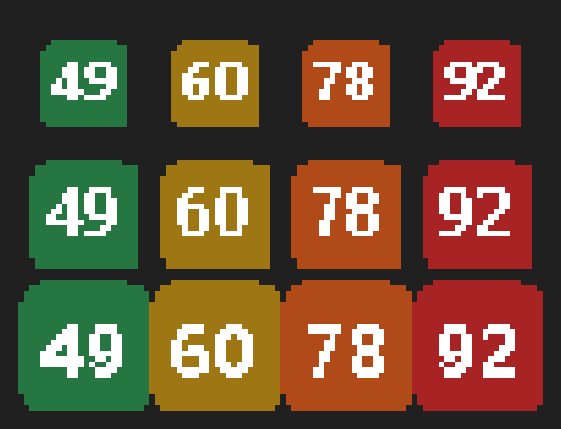

# 托盘提示自定义（最终方案：白名单 + 最坏宽度预算）

> 悬停托盘图标时显示的摘要，当前为 `OpenMIFS v0.4.4 · 均衡 · 风扇 2495/2566 RPM`。
> 本文件记录**已实现的方案**与其中的取舍（v0.5.0）。

---

## 1. 先看约束：为什么不能做成"随便填"

| 约束 | 说明 |
| :--- | :--- |
| Win32 托盘悬停提示是**单行字符串** | 不支持换行、不支持富文本 |
| .NET `NotifyIcon.Text` **上限 63 字符** | 本实现按 **62** 留 1 位余量 |
| 超长时 Win32 的表现是**静默截断** | 会切出 `风扇 2495/25…` 这种半个数字，比少显示更糟 |
| 右键菜单**没有长度限制** | 完整信息放那里（后续版本） |

**结论（用户拍板的方案）**：不做自由模板、不做"超长再丢弃"的运行时算法，
而是**只允许一组"最坏情况下也放得下"的项目** —— 从源头保证不溢出。

---

## 2. 实现方式

### 2.1 每项登记"最坏宽度"

值可能取到的最大文本宽度写死在表里（`TrayText.All`）：

| 项目 | id | 最坏宽度 | 该宽度的由来 |
| :--- | :--- | :---: | :--- |
| 版本 | `ver` | 8 | `v10.10.10` |
| 性能模式 | `mode` | 3 | `低功耗`（最长档位名） |
| 风扇转速 | `fan` | 17 | `风扇 65535/65535` |
| CPU 温度 | `cput` | 7 | `CPU 105℃` |
| CPU 功耗 | `cpup` | 9 | `CPU 105.5W` |
| CPU 频率 | `cpuf` | 9 | `CPU 5.55G` |
| CPU 负载 | `cpul` | 7 | `CPU 100%` |
| 电池电量 | `bat` | 7 | `电池 100%` |

分隔符固定 `" · "`（3 字符），顺序固定为上表顺序 —— 用"不可调"换"永不溢出"的保证。

### 2.2 预算门控

- 预算 = `62`；`WorstTotal(已选) = Σ最坏宽度 + (n-1)×3`
- 勾选一项时先试算：**超预算就不让勾**，并在提示行说明原因，例如
  「CPU 频率」最坏要 9 字符，加上会到 68（上限 62）→ 先取消一项再勾
- 界面实时显示 `最坏情况 56/62 字符　实际 48 字符`
- 配置损坏 / 组合超限（手工改 settings.txt）→ **回落默认**并写日志

### 2.3 实际宽度仍可能不足的兜底

值无论如何都在最坏宽度内（已按表截断），`Build()` 仍保留一次"整项丢弃"兜底：
超长时从**末尾整项**移除，**绝不按字符切**。

### 2.4 没有值的项自动跳过

`未实现 / 不支持 / 需要管理员 / —` 之类的值不写入快照 → 该项不会出现在提示里
（例：非管理员运行时只有 `v0.4.4` 一项会显示，其余静默省略）。

### 2.5 数据来源与隐藏态采集（实现中发现并修掉的坑）

- 值快照由主窗体刷新时写入（状态面板文本 → 版本/模式/风扇；传感器面板文本 → CPU 四项 + 电池），
  托盘**只读快照**，不重复采集
- ⚠️ 原代码 `RefreshSensors()` 第一行是 `if (!Visible) return;` —— 也就是说
  **窗口收进托盘后传感器其实不刷新**。勾了 CPU 项的托盘提示不能指望窗体刷新，
  因此新增 `MainForm.RequestHiddenSensorSnapshot()`：窗口隐藏且快照超过 8 秒时，
  由托盘触发一次**只采快照、不碰控件**的后台采集

---

## 3. 界面

主窗体左列新增分组 **「托盘悬停提示（按最坏宽度限额）」**：

- 8 个勾选项，标签带最坏宽度，如 `CPU 温度（≤7）`
- 右侧：预览（就是托盘上会显示的原文）+ `最坏情况 34/62 字符　实际 6 字符`
- 「恢复默认」按钮（默认：版本 + 性能模式 + 风扇）
- 底部提示行说明上限与替代方案（右键菜单）

配置存 `%LOCALAPPDATA%\OpenMIFS\settings.txt` 的 `tray_items` 键，逗号分隔 id；改动立即生效。

---

## 4. 验收（v0.5.0 实测）

| 项 | 结果 |
| :--- | :--- |
| 默认组合 | 提示 = `v0.4.4 · 均衡 · 风扇 2495/2566`；界面显示最坏 34/62（8+3+17+2×3 ✓） |
| 无 MIFS 权限时 | 只显示 `v0.4.4`，模式/风扇静默省略（实际 6 字符），不显示"未实现" |
| 追加 CPU 温度、CPU 功耗 | 最坏 56/62，仍在预算内 |
| 再追加任一项 | 拒绝勾选并说明原因（68/66 > 62） |
| 超长兜底 | 整项丢弃，不出现半个数字 |

---

## 5. 决策记录

| 方案 | 结论 |
| :--- | :--- |
| 自由模板 + 优先级丢弃 | **不做** —— 运行时算法不如"从源头不让超"简单可靠 |
| 右键菜单详细摘要（多行） | **不做**（用户 2026-10-04 明确）—— 托盘提示本身就够用，不再增加第二展示面 |
| 数值画进托盘图标 | ✅ **已做**，见 §6 |

---

## 6. 托盘图标上画数值（v0.5.1）

### 6.1 为什么只能放 2~3 个字符

托盘小图标的标准尺寸由系统决定（`GetSystemMetrics(SM_CXSMICON)`）：
100% 缩放 16px、125% 为 20px、150% 为 24px。16×16 里放得下且看得清的极限就是 2~3 个字符，
所以**只提供短数值**；风扇 RPM（4 位数）不适合，故不提供。

### 6.2 可选项与画法

| 下拉项 | 取值范围 | 图标内容 |
| :--- | :--- | :--- |
| 无（程序图标） | — | 保持程序自带图标 |
| CPU 温度（默认） | 2~3 位整数 | 圆角色块 + 白字，颜色按档位 |
| CPU 功耗 | 整数 W | 同上 |
| CPU 负载 | 整数 % | 同上 |

档位配色（温度为例；功耗/负载各有阈值）：

| 档位 | CPU 温度 | CPU 功耗 | CPU 负载 | 颜色 |
| :---: | :--- | :--- | :--- | :--- |
| 1 | `< 55 ℃` | `< 15 W` | `< 25 %` | 绿 `#267642` |
| 2 | `< 70 ℃` | `< 30 W` | `< 50 %` | 琥珀 `#9E7614` |
| 3 | `< 85 ℃` | `< 45 W` | `< 80 %` | 橙 `#B04A18` |
| 4 | `≥ 85 ℃` | `≥ 45 W` | `≥ 80 %` | 红 `#A82424` |



### 阈值可配置（v0.5.3）

界面「变色阈值」**跟随图标数据源**：选 CPU 温度就只给温度的三个数字框，其余同理；图标选「无」时整行隐藏。

- 三个**带上下箭头的数字框**（`NumericUpDown`）：低/中/高三档分界
- 范围：温度 20~120 ℃、功耗 1~150 W、负载 1~100 %，步进 1
- **自动维持严格递增**：把低档调高会自动把中档顶上去，不会被拒绝，也不会弹错误
- 底部说明动态显示当前映射（如 `温度阈值（℃）：≤55 绿 · ≤70 琥珀 · ≤85 橙 · 更高红`）
- 数字框**右键**可「恢复默认阈值」（只复位当前指标）

（历史写法，v0.5.3~0.5.5：三个输入框各填"三个升序数值、逗号分隔"，已废弃）

| 输入框 | settings.txt 键 | 默认值 | 含义 |
| :--- | :--- | :--- | :--- |
| 温度 | `tray_icon_t` | `55,70,85` | `<55` 绿 / `55~70` 琥珀 / `70~85` 橙 / `≥85` 红 |
| 功耗 | `tray_icon_p` | `15,30,45` | 同上（单位 W） |
| 负载 | `tray_icon_l` | `25,50,80` | 同上（单位 %） |

- 失焦即校验：必须是 3 个正数且**严格递增**，否则**不保存**、输入框回滚、提示行说明原因
- 配置文件里的值不合法（个数不对 / 非数字 / 不递增）→ **回落默认值并写回 settings.txt**（自愈，不会每次启动都告警）
- 改完立即重画图标；「恢复默认」同时复位三个阈值

### 图标尺寸（踩过的坑）

小图标要画多大，不能只信一个来源：本机实测 `GetDpiForSystem()` 返回 **96**（而注册表
`AppliedDPI=120`，即 125%），只按它会画成 16px 交给 20px 的托盘 → 被系统放大而发糊。
现在的规则是 **`max(16×dpi/96, GetSystemMetrics(SM_CXSMICON))` 再兜下限 20**：
画大被缩小只是轻微发软，画小被放大则明显糊 —— 宁大勿小。
2 字符用大字号，3 字符自动缩一档；文字用 `SingleBitPerPixelGridFit` 保证小字号不糊。

### 6.3 踩到的三个坑（都已修）

1. **GDI 句柄泄漏**：`Icon.FromHandle` 不接管所有权 —— 必须 `DestroyIcon(h)`，
   且旧 `Icon` 与每轮 `Bitmap` 都要 `Dispose`。否则每 5 秒泄漏一个 GDI 对象。
2. **隐藏态拿不到值**：`RefreshSensors()` 首行 `if (!Visible) return;`（窗口收进托盘后不刷新），
   原"按需采集"的节流用的又是**总快照时间**，被状态快照刷新误重置 → 图标长时间空白。
   现在 `TrayText.SensorTime` **单独计时**，且节流判断改为"提示项**或图标**需要传感器"。
3. **无值时的表现**：不要画空白色块（看着像坏了），而是**保持程序图标**，数据回来自动换回数字。

### 6.4 实测

`--tray`（隐藏态）运行日志：

```
托盘图标：暂时取不到 CPU 温度 的值，先保持程序图标
托盘图标：已用 CPU 温度 绘制（20px，当前 50，档位 1）
```

- `20px` = 该系统 DPI 下的小图标尺寸（125% 缩放）✓
- `档位 1` = 绿色（50 < 55）✓
- 证明隐藏态快照采集 → 图标绘制这条链路是通的

另外提供 `OpenMIFS.exe --icon-preview`：把 16/20/24px × 4 个数值画成一张放大对照图
（写到 `%LOCALAPPDATA%\OpenMIFS\tray-icon-preview.png`），用于确认可读性。

### 6.5 注意

新托盘图标在 Windows 11 上**默认落在隐藏的溢出区**（点任务栏的「^」展开可见）。
想常驻显示，把它从溢出区拖到任务栏上即可。